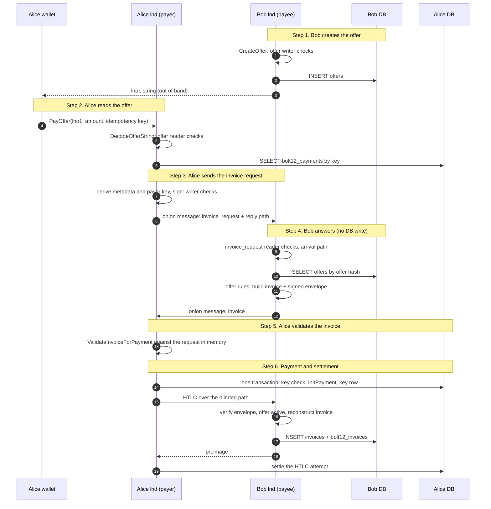
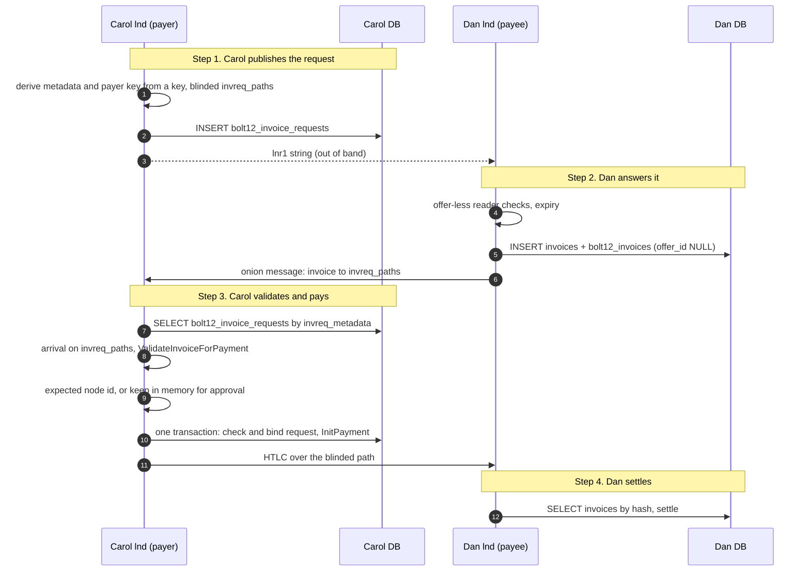

# BOLT 12 Offer Flow

This document follows one payment to an offer from end to end, with lnd as
the payee (Bob) and as the payer (Alice). For each step it names the code
that runs, the spec checks that apply, and the database rows that change.

Scope:

- The normal offer flow: `lno1` offer, `invoice_request`, `invoice`, HTLC,
  settlement.
- The offer-less flow (`lnr1`), in its own section.
- `invoice_error` is out of scope.

## Release gate

BOLT 12 lands on master behind two gates.

- **Schema.** All BOLT 12 tables are development migrations
  (`sqldb/migrations_dev.go`): `000016_offers`, `000017_bolt12_invoices`,
  `000018_bolt12_payments` and `000019_bolt12_invoice_requests`. Only
  builds with the `test_db_sqlite`, `test_db_postgres` or `test_native_sql`
  tag apply them. They are new tables. No shared invoice or payment query
  names a BOLT 12 column, so a release build runs the same queries as
  master.
- **Runtime.** `--protocol.bolt12-offers` exists only in `dev` builds. Without
  it the node builds no offer store, no BOLT 12 handler and no reconstructor,
  the invoice store never reads the BOLT 12 table, and the offer and
  invoice request RPCs return `FailedPrecondition`. At startup the node
  refuses the flag unless it runs native SQL with onion messages and route
  blinding, and the four migrations are part of the build.

The itests enable the flag through `bolt12NodeArgs`, and skip unless the
build has the `test_native_sql` tag and the backend runs native SQL.

## Overview



## Step 1. Bob creates the offer

The operator calls `CreateOffer`. The server picks the identity: the node
key as `offer_issuer_id`, or blinded message paths to self as `offer_paths`
(`server.CreateOffer`, `buildOfferPaths`). `offers.CreateOffer` then builds
the `bolt12.Offer`. It checks that an identity is present, that
`offer_description` is set with `offer_amount`, and that
`offer_absolute_expiry` is in the future.

`bolt12.EncodeOfferString` runs the offer writer checks
(`validateOfferWrite`) and produces the `lno1` string. `bolt12.OfferHash`
computes the hash that names the offer in every later step.

Database: INSERT into `offers` (`hash`, `encoded`, `is_disabled = false`,
`created_at`). This is the only row the payee writes before a payment.

## Step 2. Alice reads the offer

`PayOffer` calls `bolt12.DecodeOfferString(s, now, activeChain)`, which runs
the offer reader checks (`validateOfferRead`): known chain, not expired, no
unknown even features or types, a consistent amount and currency, and an
identity.

Alice then fixes the amount and the key:

- **Amount.** `PayOfferAmount` always gives a value for `invreq_amount`:
  the caller's amount, or `offer_amount × quantity` with an overflow check.
  An offer priced in a currency needs an explicit amount, because lnd has no
  exchange rate. In step 5, `invoice_amount` must then equal
  `invreq_amount`, so the payee cannot ask for more than Alice authorized.
- **Idempotency key.** The caller's key names one intended payment. If the
  caller gives none, the node picks a random key and reports it in the
  updates. `PayOfferParamsHash` commits to the offer, amount, quantity and
  payer note.

`resumeOfferPayment` reads the key's row:

| Key state | Result |
|---|---|
| unknown | pay |
| other parameters | refused (`ErrBolt12KeyParamsMismatch`) |
| payment deleted | refused for good (`ErrBolt12KeyConsumed`) |
| payment succeeded | return the first result, pay nothing |
| payment in flight | wait, then return its result |
| payment failed | pay again: no HTLC is in flight and none settled |

An in-memory guard lets only one call for a key negotiate at a time. It
only saves work: the database transaction in step 6 is the safety check.

Database: one read of `bolt12_payments` by key, no write.

## Step 3. Alice sends the invoice request

`DerivePayerKey` computes the metadata as an HMAC of the offer hash and the
key under `PayerSecret`, a tagged hash of the node key. The payer key is an
HMAC of the metadata under the same secret. So a retry with the same key
builds the same request bytes. The same key for another offer gives another
payer id. And `PayerPrivKeyFromMetadata` can recover the payer key from a
paid invoice, which proof of payer needs, without storing it.

`BuildInvoiceRequest` mirrors the offer into the request and adds the
amount, quantity, payer note and the derived key. `SignInvoiceRequest` runs
the request writer checks (`validateInvoiceRequestWrite`) before it signs.

The request goes out as raw TLV in an onion message (`SendInvoiceRequest`),
to the issuer or along an offer path, with a blinded reply path to Alice.
Alice subscribes for the reply before she sends, and waits up to the timeout
(60 s by default).

Database: no write. The request lives only in the waiting `PayOffer` call.

## Step 4. Bob answers the request

`Handler.HandleInvoiceRequest` runs when the request arrives:

1. `bolt12.DecodeInvoiceRequest` decodes the TLV stream.
2. `bolt12.ValidateInvoiceRequestRead` runs the request reader checks,
   including the payer signature.
3. `lookupOffer` reads the offer by the `OfferHash` of the mirrored offer
   fields. A hit proves that they match the stored offer byte for byte.
4. `ValidateInvoiceRequestForOffer` applies the offer rules: not disabled,
   not expired (`now > offer_absolute_expiry`, the same edge as the payer's
   codec), no `offer_currency`, quantity, and `invreq_amount` at least
   `offer_amount × quantity` with an overflow check.
5. `CheckArrivalPath`: for an offer with `offer_paths`, the blinded node id
   that Bob derives from the arrival path key must be the final hop of one
   of those paths. Any other path, also one of another offer, is ignored.
6. `GenerateInvoice` builds the answer: a random preimage and `path_id`, an
   envelope with the preimage, payer id, creation time, amount and quantity
   signed by the node key over the offer hash, a blinded payment path that
   carries both, and the invoice with the request fields copied byte for
   byte. It signs under the node key, or under the arrival path's blinded
   key for an offer with only `offer_paths`. `SignInvoice` runs the invoice
   writer checks first.
7. Subscribers get a notification, and the replier sends the invoice.

Database: one read (`offers` by hash), no write. A peer that sends many
requests cannot grow Bob's database.

## Step 5. Alice validates the invoice

`PayOffer` decodes the reply and calls `ValidateInvoiceReply`, which calls
`bolt12.ValidateInvoiceForPayment` with the request bytes still in memory,
`now`, the active chain, and the expected node: `offer_issuer_id`, or the
final blinded node of the offer path Alice used.

| Group | Function | What it proves |
|---|---|---|
| Read gates | `validateInvoiceRead` | Required fields, chain, features, paths match payinfo, a usable path, signature against `invoice_node_id` |
| Expiry | `validateInvoiceExpiry` | `created_at + relative_expiry` (default 7200 s) is not past |
| Mirror | `validateInvoiceAgainstRequest` | Request fields equal, `invoice_amount` equals `invreq_amount` |
| Node binding | `validateInvoiceNodeID` | `invoice_node_id` is the node Alice expected |

An invoice that arrives after the timeout or a restart has no waiting call
and is dropped. No money moved, and a retry with the same key sends the same
request.

Database: no write.

## Step 6. Payment and settlement

Alice: `BuildLightningPayment` turns the usable paths into a payment with
the invoice as its payment request and the BOLT 12 binding (key, offer hash,
parameter hash). `InitPayment` then runs one transaction:

1. `checkBolt12Key` judges the key against its current payment, before a
   failed payment with the same hash is deleted.
2. The payment hash dedup refuses a hash that is in flight or paid.
3. The payment and its intent (`intent_type = BOLT 12`, `intent_payload` =
   the `lni1` invoice) are inserted.
4. `UpsertBolt12Payment` points the key at this payment.

So one key never has two payments that have not failed, also when calls race
or the payee answers each request with a new invoice.

Bob:

1. The HTLC reaches the final hop with the `path_id` and the envelope.
2. The registry finds no invoice for the hash and calls the reconstructor.
3. `ReconstructInvoice` verifies the envelope, the preimage, the expiry
   (`now > created_at + 7200`, the same edge as the payer), and that the
   offer exists and is not disabled.
4. The registry inserts the invoice and its `bolt12_invoices` row in one
   transaction, under the registry lock.
5. A later HTLC of the open invoice runs `CheckOfferActive`. If the offer was
   disabled in the meantime, the HTLC is refused. No HTLC settles before the
   whole set is accepted, so the set times out, and the registry then
   deletes the open invoice and, by cascade, its BOLT 12 row.

| Node | Table | Change |
|---|---|---|
| Alice | `payments` | INSERT at `InitPayment` |
| Alice | `payment_intents` | INSERT the BOLT 12 intent with the invoice |
| Alice | `bolt12_payments` | INSERT the key, or point a failed key at the retry |
| Alice | `payment_htlc_attempts` and resolutions | per attempt |
| Bob | `offers` | SELECT by hash |
| Bob | `invoices` | INSERT on the first HTLC, `payment_addr = path_id`, no `payment_request` |
| Bob | `bolt12_invoices` | INSERT `invoice_id`, `offer_id`, `invreq_payer_id`, `invreq_quantity` |
| Bob | `invoice_htlcs` | per HTLC |

## Schema

```
offers                                  -- 000016
  id, hash UNIQUE, encoded, is_disabled, created_at

bolt12_invoices                         -- 000017, receiver
  invoice_id      PK → invoices(id) ON DELETE CASCADE
  offer_id        → offers(id), indexed, NULL without an offer
  invreq_payer_id NOT NULL
  invreq_quantity

bolt12_payments                         -- 000018, payer
  idempotency_key PK
  payment_id      UNIQUE → payments(id) ON DELETE SET NULL
  offer_hash      NOT NULL, indexed
  params_hash     NOT NULL
  created_at

bolt12_invoice_requests                 -- 000019, offer-less payer
  id, idempotency_key UNIQUE, invreq_metadata UNIQUE, encoded
  amount_msat, expires_at, expected_node_id, fee_limit_msat
  used            NOT NULL
  payment_id      UNIQUE → payments(id) ON DELETE SET NULL
  created_at
```

The invoice RPCs read the offer hash through `offer_id`. A payment's offer
hash comes from the invoice in `intent_payload`, and the `ListPayments` offer
filter uses `bolt12_payments.offer_hash`. A deleted payment leaves its key
row with a NULL payment, so the key stays used for good. A payment of an
invoice without an offer shows no offer hash.

## Database summary

| Step | Alice reads | Alice writes | Bob reads | Bob writes |
|---|---|---|---|---|
| 1 Create offer | | | | `offers` |
| 2 Read offer | `bolt12_payments` | | | |
| 3 Send request | | | | |
| 4 Answer | | | `offers` | |
| 5 Validate | | | | |
| 6 Pay and settle | `bolt12_payments`, `payments` | `payments`, `payment_intents`, `bolt12_payments`, attempts | `offers` | `invoices`, `bolt12_invoices`, `invoice_htlcs` |

No step writes for a request that does not end in a payment.

## Offer-less flow

An `lnr1` string is an invoice request without an offer: an offer to send
money, for a refund or a withdrawal. Its creator pays and the scanner is the
payee. The payer keeps its published requests in `bolt12_invoice_requests`.
The payee uses the receiver tables above.

Here Carol (lnd) publishes the request and pays, and Dan (lnd) scans it and
gets paid.



### Step 1. Carol publishes the request

`CreateInvoiceRequest` calls `BuildOfferlessInvoiceRequest`. The request has
no offer fields except `offer_description` and, when set,
`offer_absolute_expiry`. It sets `invreq_amount`, which is mandatory here.
It always sets blinded `invreq_paths` to Carol, built like blinded offer
paths. Without them, Dan would send the invoice to `invreq_payer_id` as a
node id, so the payer id would have to be Carol's routable node key. The
metadata and the payer key come from the idempotency key through
`DerivePayerKey` with a zero offer hash, which separates them from the keys
of every offer payment. `SignInvoiceRequest` runs the offer-less writer
branch, and `EncodeInvoiceRequestString` gives the `lnr1` string.

The caller can name an expected `invoice_node_id` and a fee budget for
paying at once. A call with a known key returns the stored request, and a
call with the key and other parameters fails.

Database: INSERT into `bolt12_invoice_requests`. Only the operator writes
new rows.

### Step 2. Dan answers the request

`SendInvoice` decodes the string with `DecodeInvoiceRequestString`, which runs
the offer-less reader branch: no `offer_chains`, `offer_features` or
`offer_quantity_max`, and `invreq_amount` present. Dan refuses a request
that answers an offer or has expired.

`GenerateOfferlessInvoice` copies the request, and Dan signs with his node
key, because the spec constrains `invoice_node_id` only for offers, and his
node key is what Carol can confirm. The operator started this flow, so Dan
stores the invoice at once, like a BOLT 11 invoice: the `invoices` row with
the `lni1` string, and the `bolt12_invoices` row with no offer link. No
envelope is needed. He sends the invoice in a new onion message to the first
`invreq_paths` entry, or to `invreq_payer_id` as a node id when the request
has no paths.

Database: INSERT into `invoices` and `bolt12_invoices` (`offer_id` NULL).

### Step 3. Carol validates and pays

The invoice arrives with no call waiting for it. A server loop takes every
invoice without offer fields. `WaitForInvoiceReply` of `PayOffer` skips
them.

1. Carol finds the request by `invreq_metadata`, which the invoice mirrors.
   An invoice for an unknown or expired request, or for a request with a
   payment that has not failed, is dropped with no write.
2. `ValidateOfferlessInvoice` requires that the invoice arrived on one of
   the request's `invreq_paths` (`CheckArrivalOnPaths`), then runs
   `ValidateInvoiceForPayment` against the stored request. The
   `invoice_amount` must equal `invreq_amount`, so Dan cannot ask for more.
3. If the request has an expected node id, only an invoice from that node
   passes, and Carol pays it at once within the stored fee budget. Without
   one, anyone who saw the string could answer first, so the invoice waits
   in memory, at most 5 per request and 100 in total.
   `ListInvoiceRequests` shows it with its `invoice_node_id`, and
   `ApproveInvoiceRequestPayment` pays it. Unsolicited invoices cause no
   writes.
4. `InitPayment` checks and binds the request in the transaction that
   creates the payment. A request with a payment that has not failed
   refuses a second invoice. A failed payment frees it. A deleted payment
   leaves it used for good.

Database: SELECT `bolt12_invoice_requests`, then in one transaction UPDATE it
and INSERT `payments` and `payment_intents` (the BOLT 12 intent with the
invoice). `bolt12_payments` is not used: the request row is the binding, and
it plays the role of the idempotency key.

### Step 4. Dan settles

The HTLC carries the `path_id` as the payment address. The registry finds
Dan's stored invoice by payment hash and settles it as any invoice. The
reconstructor does not run. The disabled-offer check for later HTLCs skips
the invoice, because it has no offer.

### Spec checks for this flow

| Requirement | Where |
|---|---|
| Writer: no offer fields, `invreq_amount` set, `invreq_paths` as for an offer | `validateInvoiceRequestWrite`, offer-less branch |
| Reader: no `offer_chains`, `offer_features`, `offer_quantity_max`, `invreq_amount` present | `ValidateInvoiceRequestRead`, offer-less branch |
| Payee sends to `invreq_paths`, else to `invreq_payer_id` | `sendOfferlessInvoice` |
| Invoice arrived on one of the `invreq_paths` | `CheckArrivalOnPaths` |
| Fields equal the request, `invoice_amount` = `invreq_amount` | `ValidateInvoiceForPayment` |
| `invoice_node_id` confirmed out of band (MAY) | expected node id, or approval |

### Database for this flow

| Step | Carol reads | Carol writes | Dan reads | Dan writes |
|---|---|---|---|---|
| 1 Publish | `bolt12_invoice_requests` | `bolt12_invoice_requests` | | |
| 2 Answer | | | | `invoices`, `bolt12_invoices` |
| 3 Pay | `bolt12_invoice_requests`, `payments` | `bolt12_invoice_requests`, `payments`, `payment_intents`, attempts | | |
| 4 Settle | | | `invoices` | `invoice_htlcs` |

## Spec checks

Codec checks are in `bolt12/validate.go` and tested in
`bolt12/validate_test.go` unless a table says otherwise.

### Offer writer: `validateOfferWrite` (step 1)

| Requirement | Test |
|---|---|
| TLV types in range, no unknown even type | "out-of-range TLV in decoded extras", "unknown even TLV in decoded extras" |
| `offer_chains` not empty | "empty offer_chains" |
| `offer_amount` > 0 | "zero amount with description" |
| `offer_description` when `offer_amount` is set | "amount without description" |
| `offer_currency` needs an amount and is ISO 4217 | currency cases |
| No blinded path with zero hops | zero-hop cases |
| `offer_issuer_id` or `offer_paths` | "no issuer or paths" |

### Offer reader: `validateOfferRead` (step 2)

| Requirement | Test |
|---|---|
| TLV type ranges, unknown even types and features | range, boundary and feature cases |
| Active chain is in `offer_chains` | chain cases |
| Amount, description and currency rules | amount cases |
| `offer_issuer_id` or `offer_paths`, no zero-hop path | identity and path cases |
| Not expired (`now > expiry` rejects) | "expired offer", "now == expiry boundary (valid)" |
| Spec vectors | `TestValidateOfferReadVectors` |

### Invoice request writer: `validateInvoiceRequestWrite` (step 3)

| Requirement | Test |
|---|---|
| `invreq_chain` is one of `offer_chains` | `TestValidateInvoiceRequestWriteChainConstraints` |
| `invreq_amount` when the offer has none, and at least `offer_amount × quantity` | `TestValidateInvoiceRequestWriteAmountConstraints` |
| Quantity rules | "offer response quantity missing with quantity_max" |
| TLV type ranges | "out-of-range TLV in decoded extras" |
| Unpredictable metadata, fresh payer key (caller) | `TestDerivePayerKey`, `TestBuildInvoiceRequestWithPayerKey` |

### Invoice request reader: `ValidateInvoiceRequestRead` (step 4)

| Requirement | Test |
|---|---|
| Payer id and metadata present, type ranges, features, paths | field, range, feature and path cases |
| Quantity rules | quantity cases |
| Amount rules | `TestValidateInvoiceRequestReadAmountBelowExpected`, "missing amount on offer response" |
| Chain is the active chain | chain cases |
| Payer signature | "invoice_request wrong key", "invoice_request mutated after signing" |
| Offer fields match a stored offer (caller) | `TestHandleInvoiceRequest_OfferNotFound` |
| Arrived on one of the `offer_paths` (caller) | `TestCheckArrivalPath` |
| No `offer_paths`: not arrived on our blinded path (caller) | **not enforced**, see open points |

### Payee offer rules (step 4)

| Rule | Test |
|---|---|
| Disabled offer | disabled case |
| Expired offer (`now > expiry`) | `TestValidateInvoiceRequestForOffer_ExpirySecond` |
| Currency offer refused | `TestValidateInvoiceRequestForOffer_Currency` |
| Amount product overflow | `TestValidateInvoiceRequestForOffer_Overflow` |
| Quantity and amount | quantity and amount cases |
| Full flow | `TestHandleInvoiceRequest_FullFlow` |

### Invoice writer: `validateInvoiceWrite` (step 4)

| Requirement | Test |
|---|---|
| Required fields, `invoice_amount` > 0, payinfo per path | field and payinfo cases |
| `invoice_node_id` = `offer_issuer_id` | "mismatched node_id and offer_issuer_id" |
| Request fields copied (caller) | `TestNewInvoiceFromRequest` |
| Blinded signing identity for `offer_paths` (caller) | `generate_test.go` |

### Invoice reader: `ValidateInvoiceForPayment` (step 5)

| Requirement | Test |
|---|---|
| Read gates and signature | `validateInvoiceRead` cases |
| Not expired | expiry boundary and overflow cases |
| Fields equal the request | "missing mirrored field", "extra mirrored field", "mismatched field data" |
| `invoice_amount` = `invreq_amount` | amount cases |
| `invoice_node_id` = the expected node | "another node on the path impersonates", "blinded impersonation" |

### Storage and settlement (step 6)

| Rule | Test |
|---|---|
| Key binds the payment | `TestBolt12KeyBindsPayment` |
| Second payment under a live key refused | `TestBolt12KeyRefusesSecondPayment` |
| Other parameters refused | `TestBolt12KeyParamsMismatch` |
| Failed payment frees the key, also for the same hash | `TestBolt12KeyRetryAfterFailure` |
| Deleted payment consumes the key | `TestBolt12KeyDeletedPayment` |
| Offer filter, BOLT 12 payments listed | `TestBolt12OfferFilter` |
| Invoice side table round trip, cascade, store gate | `invoices/bolt12_invoice_test.go` |
| Disabled offer: first and later HTLC refused | `TestReconstruct_DisabledOffer`, `TestBolt12RefusesShardAfterOfferDisabled` |
| Startup gate | `TestValidateBolt12Offers` |
| Idempotent `PayOffer` end to end | itest "bolt12 pay offer dedup" |

## Interop

Run with lt on 2026-10-08, with stacks that build lnd with
`test_native_sql` and start it with `--protocol.bolt12-offers`.

| Setup | Cases | Result |
|---|---|---|
| A, direct channels to Eclair and CLN | A1-A7: cross-decode, lnd pays both, both pay lnd, any-amount offers | all pass |
| | A8, A9: CLN publishes an `lnr1` and pays lnd's invoice, lnd publishes an `lnr1` and pays CLN's invoice | pass |
| B, multi-hop through an lnd relay chain | B1-B6: multi-hop offers, blinded offers, both pay lnd | all pass |
| | B7: Eclair and CLN pay a blinded lnd offer, so the arrival check runs for external payers | pass |
| | B8, B9: A8 and A9 over the relay chain | pass |

Eclair has no API for invoice requests without an offer, so the offer-less
cases run against CLN only.

The strict log check of setup B reports one Eclair error, `private channel
update ... was incorrectly added to staggered broadcast`. The same line is
in earlier setup B runs with an older lnd, so it is an Eclair gossip message.
All lnd nodes and CLN log no errors.

B9 needs a fee budget on the request. The default fee limit is 1% of the
amount, which does not cover the base fees of a three-hop route at test
amounts.

## Open points

1. **Arrival path for an offer without `offer_paths`.** The reader must
   ignore such a request when it arrived on a blinded path the node made.
   That needs the decrypted `path_id` of the arrival path, which the onion
   message layer does not pass to subscribers yet. The fix is to put an
   authenticated `path_id` into every offer path and expose it on
   `OnionMessageUpdate`.
2. **Metadata replay.** The payee may answer a request with the same
   `invreq_metadata` with its previous invoice. The stateless payee keeps no
   record, so it always answers with a new invoice. That is allowed.
3. **Proof of payer.** The payer key is recoverable from a paid invoice's
   metadata. The proof itself is not implemented.
4. **Payee as an introduction node.** When Dan is the introduction node of
   Carol's `invreq_paths`, he must peel the first hop himself. No test
   covers that case yet.
5. **Codec rows on master.** The three codec test rows also belong in a small
   pull request against master, where the codec now lives.
