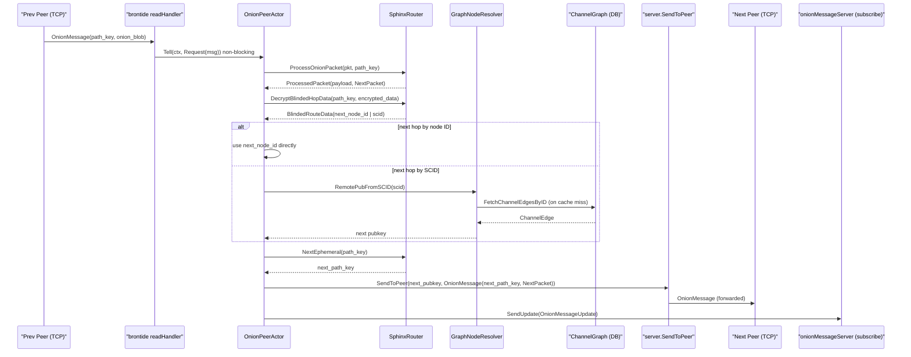

# Onion Message Forwarding Flow Diagram

Sequence of system boundaries crossed when a transit onion message arrives and
is forwarded to the next peer. See [Onion Message Forwarding
Flow](202603061000-onion-message-forwarding-flow.md) for prose explanation.

Tags: #diagram #architecture #lnd #onion-messages #networking #skip-lint

## References
- Prose: [Onion Message Forwarding Flow](202603061000-onion-message-forwarding-flow.md)

## Backlinks
- [Onion Message Forwarding Flow](zk/202603061000-onion-message-forwarding-flow.md)
