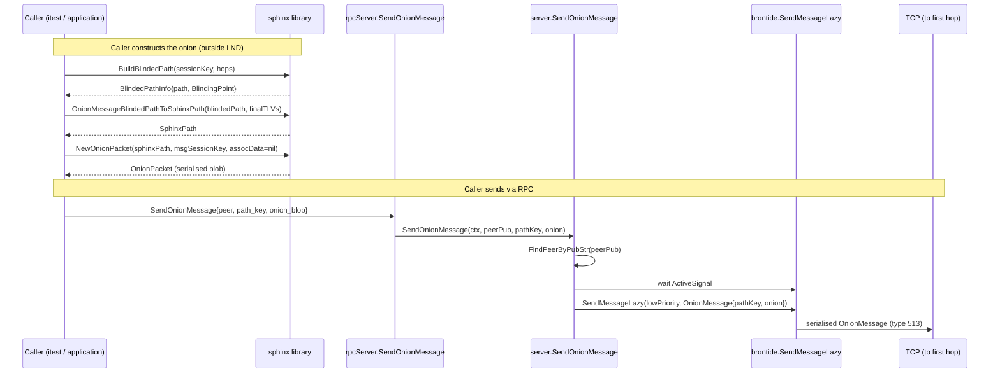

# Onion Message Sender Flow Diagram

Construction and transmission sequence for an outgoing onion message. See [Onion
Message Sender Flow](202603061020-onion-message-sender-flow.md) for prose
explanation.

Tags: #diagram #architecture #lnd #onion-messages

## References
- Prose: [Onion Message Sender Flow](202603061020-onion-message-sender-flow.md)

## Backlinks
- [Onion Message Sender Flow](zk/202603061020-onion-message-sender-flow.md)
