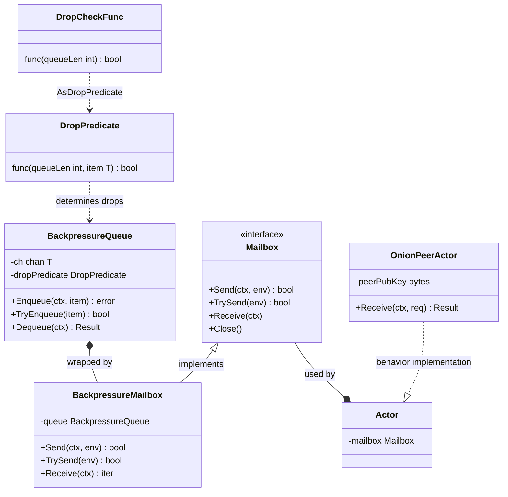

# Backpressure Queue Context Diagram

This diagram illustrates the structural relationships between the core queue
components, the mailbox abstraction, and the actor system used for onion
messaging.

The [backpressure mechanism](202603061010-onion-message-backpressure-red.md)
integrates with the actor model by wrapping a generic channel-based queue inside
a mailbox interface. This allows actors to transparently shed load using drop
predicates like Random Early Detection.

Tags: #diagram #architecture #lnd #concurrency #onion-messages #skip-lint

## References

## Backlinks
- [Onion Message Backpressure Red](zk/202603061010-onion-message-backpressure-red.md)
