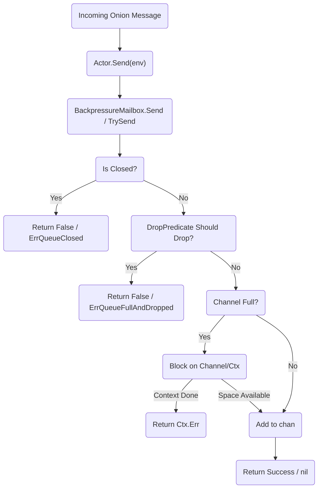

# Backpressure Queue Execution Flow

This flowchart illustrates the path of an incoming message into the
`BackpressureMailbox`. It highlights the
[Random Early Drop (RED)](202603061010-onion-message-backpressure-red.md) logic
and the possible error paths when attempting to enqueue an item.

The drop predicate allows the actor system to shed load proactively before the
underlying channel becomes fully saturated.

Tags: #diagram #architecture #lnd #concurrency #onion-messages #skip-lint

## References

## Backlinks
- [Onion Message Backpressure Red](zk/202603061010-onion-message-backpressure-red.md)
