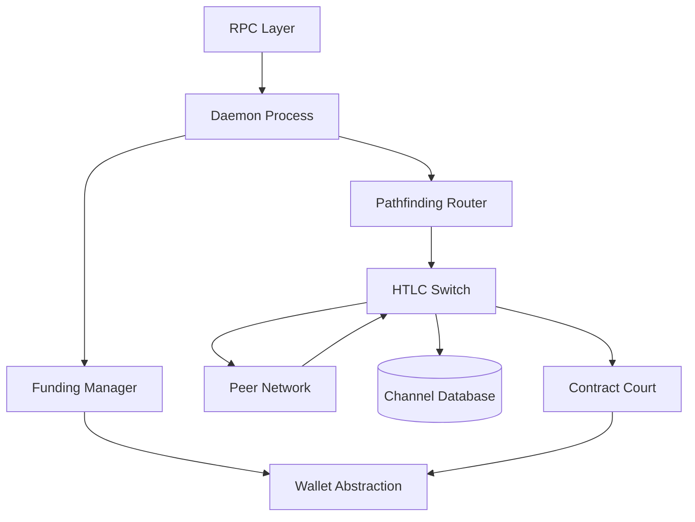

# Lightning Network Daemon Architecture

The Lightning Network Daemon (`lnd`) is a complete, modular implementation of a
Lightning Network node. Instead of a monolithic codebase, it coordinates an
ecosystem of decoupled subsystems that manage distinct lifecycle phases of the
network, ranging from peering and payment routing to on-chain state enforcement.

## Architecture Map

## Execution Core
- **Orchestration:** [Daemon Process](202603181001-lnd-daemon-process.md) wires
  together modular interfaces without tight coupling.
- **Data Plane:** [HTLC Switch](202603181002-htlc-switch-routing.md) atomically
  forwards time-locked payments across channels.

## Network Layer
- **Multiplexing:** [Peer Network](202603181006-peer-network-management.md)
  handles encrypted BOLT 8 transport.
- **Topology:** [Pathfinding Router](202603181005-pathfinding-router.md)
  discovers routes over the authenticated channel graph.

## On-Chain Operations
- **Channel Bootstrapping:**
  [Funding Manager](202603181007-funding-manager.md) orchestrates the
  interactive channel creation state machine.
- **Enforcement:** [Contract Court](202603181008-contract-court-arbitration.md)
  arbitrates disputes and sweeps funds on-chain.
- **State Persistence:**
  [Channel Database](202603181004-channel-state-database.md) securely logs
  channel mutations.
- **UTXO Management:**
  [Wallet Abstraction](202603181003-lightning-wallet-abstraction.md)
  abstracts underlying blockchain backends.

Tags: #architecture #lightning-network #software-architecture #entry-point #diagram

## References

## Backlinks
- [Lnd Daemon Process](202603181001-lnd-daemon-process.md)
- [Htlc Switch Routing](202603181002-htlc-switch-routing.md)
- [Lightning Wallet Abstraction](202603181003-lightning-wallet-abstraction.md)
- [Channel State Database](202603181004-channel-state-database.md)
- [Peer Network Management](202603181006-peer-network-management.md)
- [Funding Manager](202603181007-funding-manager.md)
- [Contract Court Arbitration](202603181008-contract-court-arbitration.md)
