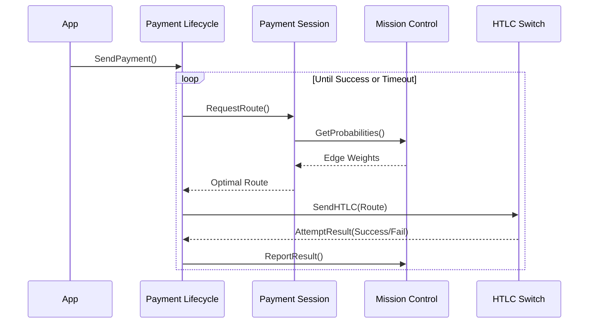

# Pathfinding Router Dynamics

This collection maps out the algorithms and state machines that make Lightning
Network routing resilient and private.

## Architecture

## Routing Subsystems
- **State Machine:**
  [Payment Lifecycle](202603181011-payment-lifecycle-state-machine.md)
  orchestrates the retry loop.
- **Path Generation:**
  [Payment Session](202603181013-payment-session-pathfinding.md)
  isolates pathfinding constraints.
- **Liquidity Estimation:**
  [Mission Control](202603181012-mission-control-probability.md)
  models edge capacities.
- **Sharding:**
  [Multi-path Sharding](202603181014-multi-path-payment-sharding.md)
  bypasses liquidity bottlenecks.
- **Privacy:** [Blinded Paths](202603181015-blinded-paths-privacy.md) obscure
  payment destinations.

Tags: #routing #pathfinding #entry-point #diagram

## References
- Refines the router defined in: [Pathfinding Router](202603181005-pathfinding-router.md)

## Backlinks
- [Payment Lifecycle State Machine](202603181011-payment-lifecycle-state-machine.md)
- [Mission Control Probability](202603181012-mission-control-probability.md)
- [Multi Path Payment Sharding](202603181014-multi-path-payment-sharding.md)
- [Blinded Paths Privacy](202603181015-blinded-paths-privacy.md)
