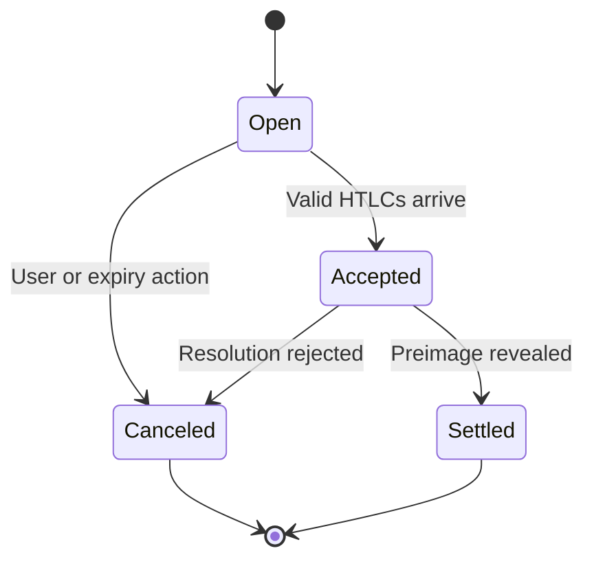

# Invoice State Machine Enforces Strict Progression

An invoice progresses through a rigorous set of states during its lifecycle to
ensure a predictable progression for associated payments. By design, the state
machine is linear and unidirectional. When initially created, the invoice enters
the **Open** state. This state signifies that the node is ready to accept an
incoming payment that satisfies the invoice's cryptographic and temporal rules.

When valid HTLCs arrive that satisfy the invoice constraints, the state machine
transitions to the **Accepted** state. At this point, the node considers the
payment conditions met, but the payment is not yet final. The node still holds
the HTLCs and has not yet revealed the cryptographic preimage to the network,
allowing [hold invoices](202603250834-hold-invoices.md) to defer the finality.

Finally, the invoice transitions to the **Settled** state upon revealing the
preimage, indicating successful receipt of funds, or to the **Canceled** state
if the payment is rejected. A canceled invoice ensures that any locked HTLCs are
failed backward through the network. Once in a terminal state—settled or
canceled—the invoice state can never change again.

Tags: #invoices #state-machine #htlc

## References
- Governs the progression of: [Invoice settlement flow](202603250837-invoice-settlement-flow.md)

## Backlinks
- [Invoices](202603250830-Invoices.md)
- [Invoice Settlement Flow](202603250837-invoice-settlement-flow.md)
- [Invoice Registry](202603250838-invoice-registry.md)
- [Invoice Database Storage](202603250839-invoice-database-storage.md)
- [Invoice Subscriptions](202603250840-invoice-subscriptions.md)
