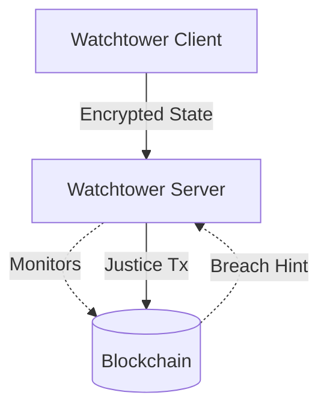

# Watchtower Architecture Provides Offline Security

Watchtowers provide an asynchronous security layer that protects Lightning
Network channels when a user's node goes offline. They act as independent
delegates that monitor the blockchain for malicious breaches and enforce the
honest channel state.

## State Delegation
The local node delegates enforcement without revealing the actual contents of
the channel.

- **Outsourcing:** The [watchtower client](202603251001-watchtower-client-outsources-monitoring.md)
  encrypts the justice transaction and sends it to the tower.
- **Enforcement:** The [watchtower server](202603251002-watchtower-server-enforces-breaches.md)
  blindly monitors the chain and acts only if a breach hint is detected.

## Flow

Tags: #architecture #security #entry-point #diagram

## References

## Backlinks
- [Lnd Architecture](202603181000-Lnd-Architecture.md)
- [Watchtower Client Outsources Monitoring](202603251001-watchtower-client-outsources-monitoring.md)
