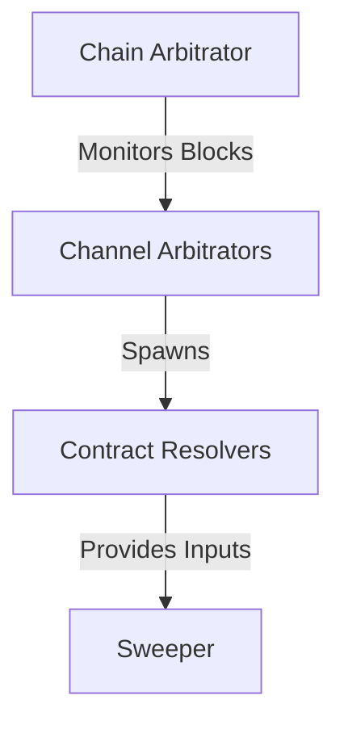

# Contract Court Resolution Resolves Disputed Channels

The `contractcourt` is the on-chain enforcement mechanism of the architecture.
Channel closures are not simply socket disconnects; when a peer misbehaves, goes
offline, or broadcasts an outdated state, the contract court watches the
blockchain for breaches and resolves unilateral closes.

## Dispute Management Hierarchy

## Arbitrators
- **Global Dispatcher:** The [Chain
  Arbitrator](202603251004-chain-arbitrator-dispatches-events.md) monitors new
  blocks and maps them to channel disputes.
- **Channel State Machine:** The [Channel
  Arbitrator](202603251005-channel-arbitrator-manages-lifecycle.md) manages the
  full on-chain resolution lifecycle of a single channel.

## Spend Operations
- **Contract Resolution:** Distinct [Contract
  Resolvers](202603251006-contract-resolvers-sweep-outputs.md) know how to claim
  specific outputs like HTLCs or anchors.
- **Batching:** The [Sweeper](202603251007-sweeper-batches-utxo-spends.md)
  aggregates these time-sensitive spends into fee-efficient transactions.

Tags: #architecture #dispute-resolution #on-chain #entry-point #diagram

## References

## Backlinks
- [Lnd Architecture](202603181000-Lnd-Architecture.md)
- [Lightning Wallet Abstraction](202603181003-lightning-wallet-abstraction.md)
- [Chain Arbitrator Dispatches Events](202603251004-chain-arbitrator-dispatches-events.md)
- [Sweeper Batches Utxo Spends](202603251007-sweeper-batches-utxo-spends.md)
