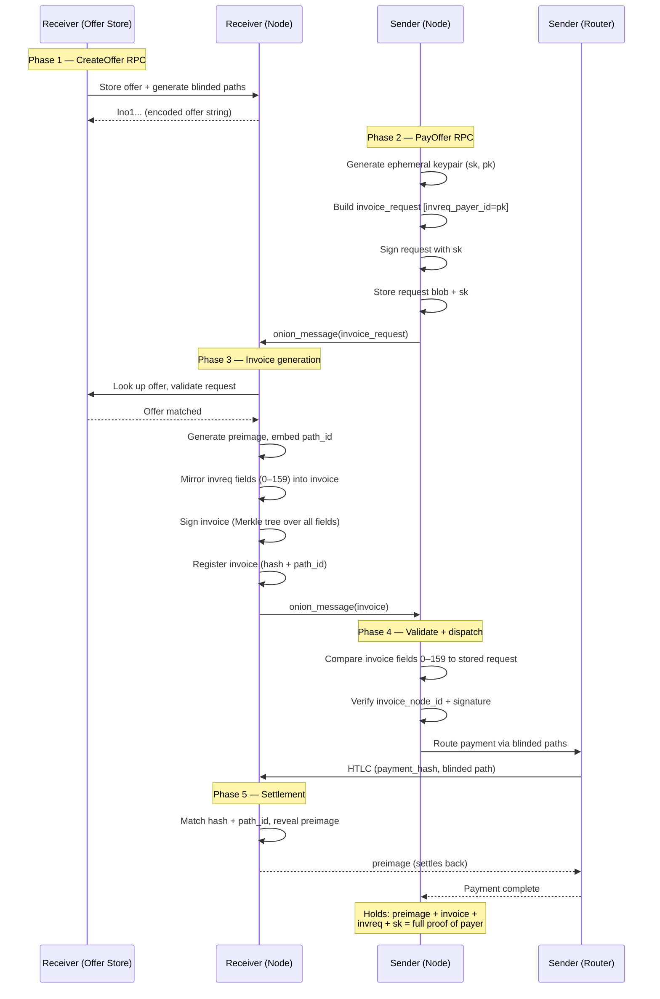

# Routed Payment Completes the BOLT 12 Multi-Hop Flow

This zettel sketches the full lifecycle of a BOLT 12 payment between two LND
nodes — from the moment the receiver creates an offer to the moment the sender's
payment settles. It focuses on the user-pays-merchant variant because that is
the primary flow most users encounter. None of this is implemented in LND yet;
the purpose is to map out the high-level subsystem interactions that will need
to exist.

## Phase 1: Offer Creation (Receiver)

The receiver creates a persistent offer via an RPC (e.g., `CreateOffer`). The
node generates the offer TLV containing the amount policy, description, and —
critically — one or more [blinded paths](lnd/202603181015-blinded-paths-privacy.md)
that allow the sender to reach it without learning the receiver's node identity.
The offer is stored in a new **offer store** so it can be matched against future
invoice requests. The encoded `lno`-prefixed string is returned to the user for
sharing (QR code, URL, NFC, etc.).

## Phase 2: Invoice Request (Sender)

The sender scans the offer and calls an RPC (e.g., `PayOffer`). The node decodes
the [offer
message](bolts/202603251300-bolt-12-offer-message-initiates-negotiation.md),
validates it per the [offer reader
requirements](bolts/202603251320-bolt-12-offer-reader-requirements.md), and
constructs an `invoice_request` TLV. The node generates a fresh ephemeral
keypair, places the public key in `invreq_payer_id` (TLV type 88), and signs the
request with the private key. The full invoice request is persisted in the
[invoice request store](202603261200-invoice-request-store.md) alongside the
ephemeral private key — both are needed later for invoice validation and [proof
of payer](202603261145-proof-of-payer.md). The node then wraps the request in an
onion message and routes it to one of the offer's blinded path introduction
nodes.

## Phase 3: Invoice Generation (Receiver)

The receiver's onion message handler unwraps the request. It looks up the
matching offer in the [offer store](202603261045-offer-store.md) and validates
the request per the [invoice request reader
requirements](bolts/202603251330-bolt-12-invoice-request-reader-requirements.md).
If valid, the node generates a BOLT 12 invoice: it picks a fresh preimage and
payment hash, embeds a unique [`path_id`](202603261115-blinded-path-id-replay-prevention.md)
in the blinded path's final hop for replay prevention, constructs blinded
payment paths for the actual HTLC (via the [pathfinding
router](lnd/202603181010-Pathfinding-Router.md)), and mirrors all invreq fields
(types 0–159) into the invoice — including `invreq_payer_id`. The node signs the
invoice per the [signature requirements](bolts/202603251350-bolt-12-signature-calculation.md)
using a Merkle tree over all non-signature fields, and sends the [invoice
message](bolts/202603251310-bolt-12-invoice-message-provides-payment-parameters.md)
back as a reply onion message. Simultaneously, the node registers the invoice in
the [invoice registry](lnd/202603250830-Invoices.md) so the HTLC switch knows to
settle it when the payment arrives. The `path_id` is stored in the
`payment_addr` column for HTLC matching.

## Phase 4: Payment Dispatch (Sender)

The sender's onion message handler receives the invoice reply. The node
retrieves the original invoice request from the [invoice request store](202603261200-invoice-request-store.md)
and performs a byte-for-byte comparison of all fields in ranges 0–159 and
1000000000–2999999999 — rejecting the invoice if any mismatch is found. It also
verifies `invoice_node_id` matches the expected identity (`offer_issuer_id` or
the `blinded_node_id` from the original request), validates the receiver's
Merkle tree signature, and checks the invoice arrived via the request's
`reply_path`. Once validated, the node hands the invoice's blinded payment paths
and payment hash to the router, which finds a route to the introduction node and
dispatches the HTLC through the [HTLC
switch](lnd/202603181002-htlc-switch-routing.md).

## Phase 5: Settlement

The HTLC propagates through the network, following the blinded path to the
receiver. The receiver's HTLC switch matches the payment hash and `path_id` (via
`payment_addr`) against the registered invoice, reveals the preimage, and the
HTLC settles back along the route. The sender receives the preimage as proof of
payment. After settlement, the sender holds three pieces of evidence for [proof
of payer](202603261145-proof-of-payer.md): the preimage (proof someone paid),
the invoice with `invreq_payer_id` committed by the receiver's signature (proof
the receiver acknowledged this payer), and the original invoice request with the
payer's own signature plus the ephemeral private key (proof the payer actually
initiated it).

Tags: #bolt-12 #lnd #feature-request #workflow

## References
- Spec-level flows: [BOLT 12 Payment Flows Separate Requesting From Invoicing](bolts/202603251220-bolt-12-payment-flow-scenarios.md)
- Offer message: [BOLT 12 Offer Message Initiates Negotiation](bolts/202603251300-bolt-12-offer-message-initiates-negotiation.md)
- Invoice request reader: [BOLT 12 Invoice Request Reader Requirements](bolts/202603251330-bolt-12-invoice-request-reader-requirements.md)
- Invoice writer: [BOLT 12 Invoice Writer Requirements](bolts/202603251335-bolt-12-invoice-writer-requirements.md)
- Invoice reader: [BOLT 12 Invoice Reader Requirements](bolts/202603251340-bolt-12-invoice-reader-requirements.md)
- Blinded paths: [Blinded Paths Obscure Payment Destinations](lnd/202603181015-blinded-paths-privacy.md)
- HTLC routing: [HTLC Switch](lnd/202603181002-htlc-switch-routing.md)
- Invoice registry: [Invoices Orchestrate Payment Receipt](lnd/202603250830-Invoices.md)
- Sender storage: [Sender-Side Payment Storage Mostly Supports BOLT 12](202603261100-sender-side-bolt12-storage-ready.md)
- Invoice request store: [Invoice Request Store Persists Outgoing BOLT 12
  Requests](202603261200-invoice-request-store.md)
- Replay prevention: [Path ID Reuses Payment Address for Blinded Invoice Lookup](202603261115-blinded-path-id-replay-prevention.md)
- Payer identity: [Proof of Payer Binds a Payment to the Entity That Requested
  It](202603261145-proof-of-payer.md)

## Backlinks
- [Feature Backlog](202603251500-Feature-Backlog.md)
- [Offer Store](202603261045-offer-store.md)
- [Sender Side Bolt12 Storage Ready](202603261100-sender-side-bolt12-storage-ready.md)
- [Blinded Path Id Replay Prevention](202603261115-blinded-path-id-replay-prevention.md)
- [Proof Of Payer](202603261145-proof-of-payer.md)
- [Invoice Request Store](202603261200-invoice-request-store.md)
- [Reply Message Path Builder](202603261215-reply-message-path-builder.md)
- [Onion Message Pathfinding](202603261220-onion-message-pathfinding.md)
- [Bolt12 Mvp Direct Peers](202603261230-bolt12-mvp-direct-peers.md)
- [Bolt12 Micro Mvp](202603261245-bolt12-micro-mvp.md)
- [Bolt12 Implementation Strategy](202603261300-bolt12-implementation-strategy.md)
