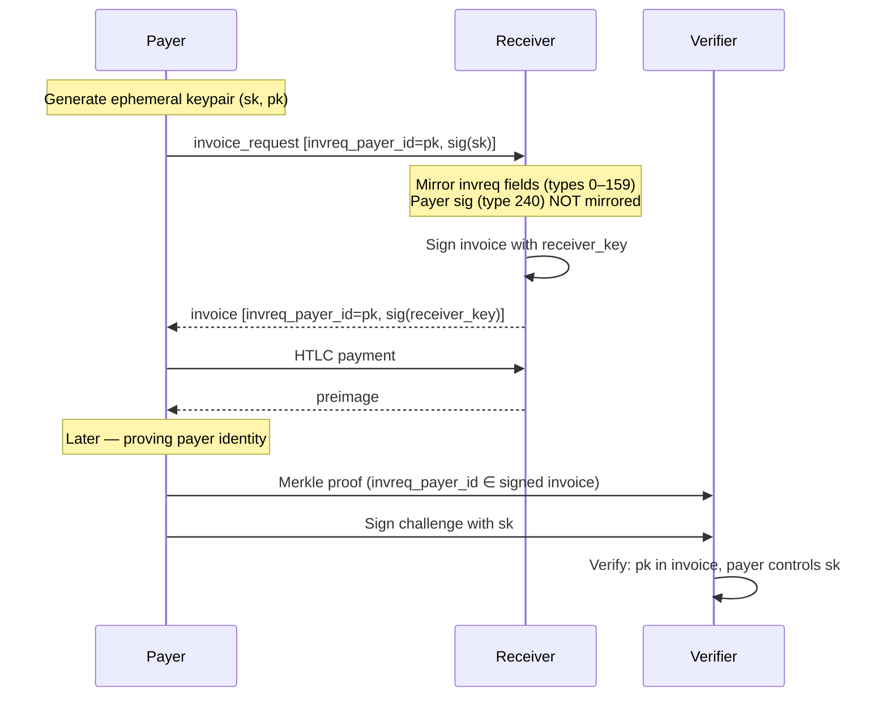

# Proof of Payer Binds a Payment to the Entity That Requested It

BOLT 11 provides proof of payment — the preimage proves *someone* paid — but not
proof of *who* paid. BOLT 12 closes this gap through the `invreq_payer_id`, an
ephemeral public key the payer generates per invoice request that gets
cryptographically bound into the invoice.

## How It Works

When the payer constructs an `invoice_request`, it generates a fresh ephemeral
keypair. The public key is placed in `invreq_payer_id` (TLV type 88), and the
request is signed with the corresponding private key (TLV type 240). The
receiver mirrors all invreq fields in the range 0–159 into the invoice —
including `invreq_payer_id` — but *not* the payer's signature (type 240, outside
the mirrored range). The receiver then signs the entire invoice with its own key
via the [Merkle tree
signature](bolts/202603251350-bolt-12-signature-calculation.md).

The result is that the payer's public key is committed to by the receiver's
signature, but the payer's own signature lives only on the `invoice_request`
wire message. For proof of payer, the payer's original signature is not needed —
what matters is that the payer can demonstrate control of the private key behind
`invreq_payer_id`, and the receiver's invoice signature proves that key was part
of the acknowledged invoice.

To exercise proof of payer after settlement, the payer demonstrates control of
the private key behind `invreq_payer_id` (e.g., by signing a challenge). A
verifier can then confirm via a [selective Merkle proof](bolts/202603251240-bolt-12-merkle-tree-signatures.md)
that `invreq_payer_id` is part of the signed invoice — without the payer needing
to reveal the full invoice contents.

## Sender Must Store the Invoice Request and Ephemeral Key

Without the payer's signature on the original invoice request, the receiver
could fabricate an invoice with any `invreq_payer_id` it chooses. The payer's
signature (type 240, not mirrored into the invoice) is what proves the key
holder actually initiated the request. The sender must therefore store the full
invoice request for a complete proof chain — see [Invoice Request
Store](202603261200-invoice-request-store.md).

The ephemeral private key must also be stored separately. It is ephemeral by
design — a new one per invoice request — so it does not link payments to each
other or to the payer's node identity. But it never appears in any wire message.
If lost, proof of payer is permanently impossible for that payment.

Tags: #bolt-12 #lnd #cryptography #invoices

## References
- Signature construction: [BOLT 12 Signature Calculation Using BIP-340 and
  Merkle Trees](bolts/202603251350-bolt-12-signature-calculation.md)
- Selective revelation: [BOLT 12 Merkle Tree Signatures Enable Selective
  Revelation](bolts/202603251240-bolt-12-merkle-tree-signatures.md)
- Sender storage: [Sender-Side Payment Storage Mostly Supports BOLT 12](202603261100-sender-side-bolt12-storage-ready.md)
- Payer ID in protocol: [BOLT 12 Invoice Request Message Links Payer to Offer](bolts/202603251305-bolt-12-invoice-request-links-payer-to-offer.md)
- Flow context: [BOLT 12 Offer-to-Payment Flow Between Two LND Nodes](202603261030-bolt-12-offer-to-payment-flow.md)

## Backlinks
- [Bolt 12 Offer To Payment Flow](202603261030-bolt-12-offer-to-payment-flow.md)
- [Sender Side Bolt12 Storage Ready](202603261100-sender-side-bolt12-storage-ready.md)
- [Invoice Request Store](202603261200-invoice-request-store.md)
- [Bolt12 Mvp Direct Peers](202603261230-bolt12-mvp-direct-peers.md)
- [Bolt12 Implementation Strategy](202603261300-bolt12-implementation-strategy.md)
- [Bolt12 Rpc Response Extensions](202603261330-bolt12-rpc-response-extensions.md)
