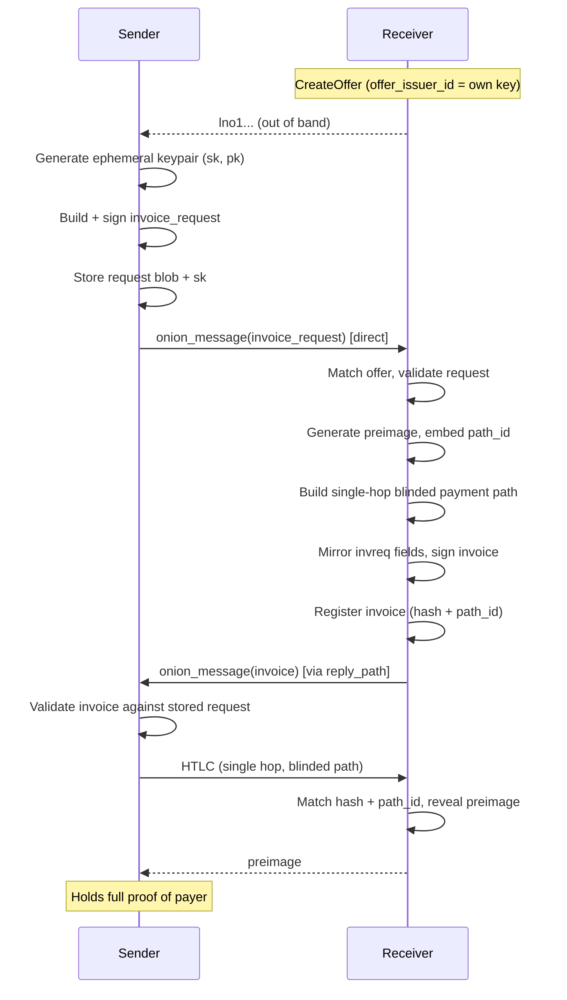

# Direct Payment Delivers First BOLT 12 Settlement

The full [Routed Payment](202603261030-bolt-12-offer-to-payment-flow.md) flow
requires multi-hop onion message pathfinding and blinded message path
construction — neither of which has a production implementation in LND. The
Direct Payment milestone restricts sender and receiver to direct peers,
eliminating these dependencies while exercising the entire protocol end to end.

## What Changes

When sender and receiver share a direct channel, every message and payment is a
single hop. The offer uses `offer_issuer_id` (the receiver's own node ID)
instead of `offer_paths`, so the sender knows exactly who to talk to. The reply
path is a single-hop path back to the sender. The blinded payment path in the
invoice is a single-hop path where the receiver is both introduction node and
destination. No graph traversal is needed for any of these.

## Still Required

These components must be built for the MVP:

- **Offer store** — new SQL table for persisting offers on the receiver side.
  See [Offer Store](202603261045-offer-store.md).
- **Invoice table extension** — `is_bolt12`, `offer_id`, `invoice_node_id`,
  `invreq_payer_id` columns. See [Invoice Table
  Extension](202603261130-bolt12-invoice-table-extension.md).
- **Invoice request store** — sender persists the request blob and ephemeral
  private key. See [Invoice Request
  Store](202603261200-invoice-request-store.md).
- **Single-hop blinded path construction** — trivial case where the receiver is
  both introduction node and destination. Embeds `path_id` for replay
  prevention.
- **Single-hop reply path** — sender builds a one-hop reply path back to itself
  for the receiver to return the invoice.
- **TLV encoding/decoding** — offer, invoice_request, and invoice message
  serialization.
- **Merkle tree signature** — creation (receiver) and verification (sender) per
  the [signature spec](bolts/202603251350-bolt-12-signature-calculation.md).
- **Onion message send to direct peer** — already works in the `onionmessage`
  package.

## Deferred to Post-MVP

- [Multi-hop blinded message path builder](202603261215-reply-message-path-builder.md)
- [Onion message pathfinding through the graph](202603261220-onion-message-pathfinding.md)
- `offer_paths` for receiver privacy (offers without `offer_issuer_id`)
- Multi-hop blinded payment paths in invoices
- Merchant-pays-user flow (refunds)

Tags: #bolt-12 #lnd #feature-request #workflow

## References
- Full flow: [BOLT 12 Offer-to-Payment Flow Between Two LND Nodes](202603261030-bolt-12-offer-to-payment-flow.md)
- Offer store: [Offer Store Persists Long-Lived BOLT 12 Offers](202603261045-offer-store.md)
- Invoice extension: [Invoice Table Extension Adds BOLT 12 Columns](202603261130-bolt12-invoice-table-extension.md)
- Invoice request store: [Invoice Request Store Persists Outgoing BOLT 12
  Requests](202603261200-invoice-request-store.md)
- Replay prevention: [Path ID Reuses Payment Address for Blinded Invoice Lookup](202603261115-blinded-path-id-replay-prevention.md)
- Proof of payer: [Proof of Payer Binds a Payment to the Entity That Requested
  It](202603261145-proof-of-payer.md)

## Backlinks
- [Feature Backlog](202603251500-Feature-Backlog.md)
- [Bolt12 Micro Mvp](202603261245-bolt12-micro-mvp.md)
- [Bolt12 Implementation Strategy](202603261300-bolt12-implementation-strategy.md)
- [Bolt12 Interop Testing](202603261315-bolt12-interop-testing.md)
