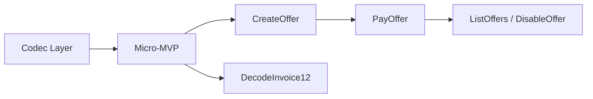

# Protocol Codec Establishes the BOLT 12 Foundation

Before building the full [Direct Payment](202603261230-bolt12-mvp-direct-peers.md)
milestone with offer stores, invoice extensions, and HTLC settlement, an even
smaller slice can exercise the BOLT 12 protocol: decode an offer and request an
invoice from a peer. No payments, no new storage, no receiver-side logic in LND
— just the sender half of the negotiation.

## Two New RPCs

**`DecodeOffer`** — Takes an `lno1...` string and returns the decoded offer
fields: description, amount, issuer, chains, expiry, quantity limits,
`offer_issuer_id`, and any `offer_paths`. Pure stateless utility analogous to
`DecodePayReq` for BOLT 11. This requires building the BOLT 12 TLV deserializer
and the `lno` bech32 decoder.

**`RequestInvoice`** — Takes a decoded offer (or raw `lno1...` string) and a
peer's node ID. The node generates an ephemeral keypair, constructs and signs an
`invoice_request`, sends it to the peer via the existing `SendOnionMessage` RPC
path, waits for the invoice reply on `SubscribeOnionMessages`, validates the
invoice against the original request per the [invoice reader
requirements](bolts/202603251340-bolt-12-invoice-reader-requirements.md), and
returns the decoded BOLT 12 invoice to the caller. This exercises the sender
side of Phases 2–4 from the [flow zettel](202603261030-bolt-12-offer-to-payment-flow.md)
without dispatching any HTLCs.

## What This Exercises

- BOLT 12 TLV encoding and decoding (offer, invoice_request, invoice)
- `lno` / `lnr` / `lni` bech32 encoding (no checksum, unlike BOLT 11)
- BIP-340 Merkle tree signature creation (for the invoice request) and
  verification (for the received invoice)
- Ephemeral keypair generation for `invreq_payer_id`
- Byte-for-byte invoice validation against the stored request
- Onion message send/receive to a direct peer (already works)

## What It Does Not Require

- **No offer store** — the sender does not create offers
- **No invoice table changes** — no invoices are registered or settled
- **No invoice request store** — the request only needs to live in memory for
  the duration of the RPC call
- **No HTLC dispatch** — the flow stops after displaying the invoice
- **No blinded path construction** — for the micro-MVP the sender can use a
  single-hop reply path or even omit privacy (direct peer)

The receiver side can be a different implementation (e.g., CLN) that already
supports BOLT 12, enabling early interop testing.

## Roadmap

The micro-MVP establishes the codec and validation foundation. Subsequent steps
build on it incrementally.

### Codec Layer (prerequisite for micro-MVP)

These are library-level building blocks, not RPCs:

- **Offer encode/decode** — serialize and parse the `offer` TLV stream per the
  [TLV message structures](bolts/202603251250-bolt-12-tlv-message-structures.md)
  and [bech32 encoding rules](bolts/202603251260-bolt-12-encoding-and-bech32-usage.md)
  (`lno` prefix, no checksum).
- **Invoice request encode/decode** — serialize and parse the `invoice_request`
  TLV stream including the payer's
  [signature](bolts/202603251350-bolt-12-signature-calculation.md).
- **Invoice encode/decode** — serialize and parse the `invoice` TLV stream
  including the receiver's signature and mirrored fields.

### RPC Progression

1. **Micro-MVP** — `DecodeOffer` + `RequestInvoice` (this zettel)
2. **`CreateOffer`** — receiver side, stores in [offer
   store](202603261045-offer-store.md), returns `lno1...`
3. **`PayOffer`** — full flow: request invoice + validate + HTLC dispatch.
   Requires [invoice table extension](202603261130-bolt12-invoice-table-extension.md)
   and [invoice request store](202603261200-invoice-request-store.md).
4. **`ListOffers`** / **`DisableOffer`** — offer lifecycle management
5. **`DecodeInvoice12`** — decode an `lni1...` string, display BOLT 12 invoice
   fields

Tags: #bolt-12 #lnd #feature-request #rpc #workflow

## References
- Direct-peers MVP: [BOLT 12 MVP Scopes to Directly Connected Peers](202603261230-bolt12-mvp-direct-peers.md)
- Full flow: [BOLT 12 Offer-to-Payment Flow Between Two LND Nodes](202603261030-bolt-12-offer-to-payment-flow.md)
- Invoice validation: [BOLT 12 Invoice Reader Requirements](bolts/202603251340-bolt-12-invoice-reader-requirements.md)
- Existing onion RPC: `SendOnionMessage` / `SubscribeOnionMessages` in
  `lnrpc/lightning.proto`

## Backlinks
- [Feature Backlog](202603251500-Feature-Backlog.md)
- [Bolt12 Implementation Strategy](202603261300-bolt12-implementation-strategy.md)
- [Bolt12 Interop Testing](202603261315-bolt12-interop-testing.md)
